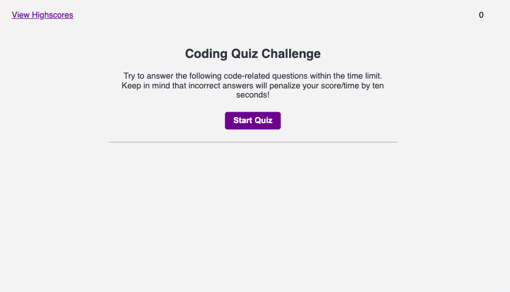

# Web APIs Challenge: Code Quiz

This project is to create a coding assessment Webpage. No html or css template was provided, We were tasked with generating the HTML, CSS, and JavaScript to complete the task.

The web appplication queries the visitor a series of questions and grades the vistor according to the answers choosen. The web app essentially works as a game. When the visitor clicks the button to "Start quiz", a timer starts. Each answer progresses to the next question until complete. When you get to the end, the app asks you to input your initials to add to the Highscore. Once 
entered and submitted, you are shown the high score list.

The highscores are saved to Local storage when added, they are grabbed and sorted by number in descending order (highest to lowest) on the highscore section. A visitor may clear the high scores from local storage by selecting the button "Clear Highscores"

The web application utilizes addEventListener, setInterval, getElementById, and setTimeout

[Link to working example](https://xclusive36.github.io/ApiCodeQuiz/)
